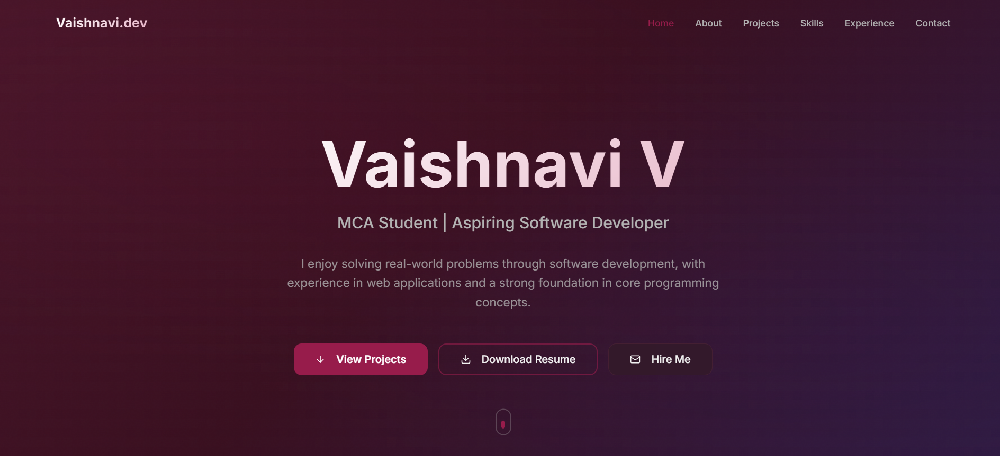
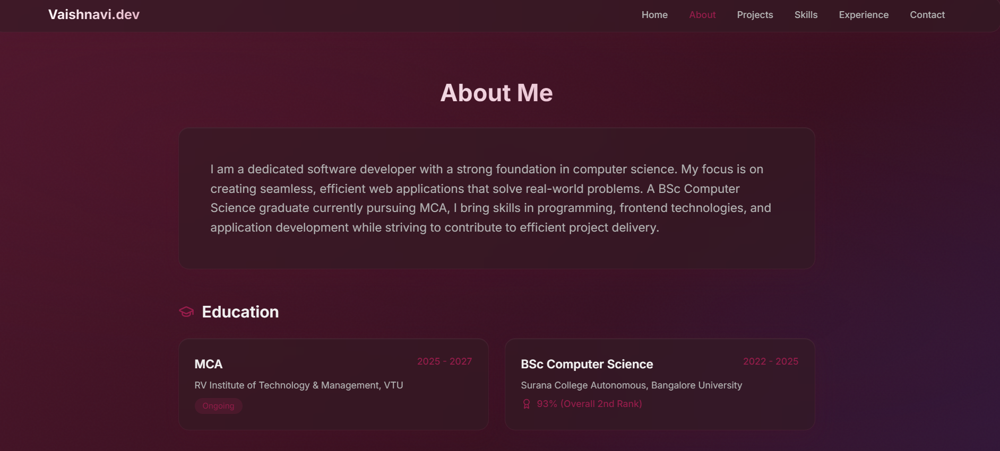

# Vaishnavi V – Portfolio

## Live Demo

Portfolio: https://at-vaishnavi.lovable.app

---

## About the Project

This is my **personal portfolio website** built using **React and Tailwind CSS** to showcase my projects, technical skills, and achievements.

The portfolio highlights my work in **web development**, including the projects I have built, the technologies I use, and my contact information.

---

## Features

* Responsive design for desktop and mobile
* Projects showcase section
* Skills and technologies section
* Contact information
* Clean and modern UI

---

## Project Screenshots

### Portfolio Home Page

---

## Tech Stack

* React
* TypeScript
* Tailwind CSS
* Vite

---

## What I Learned

* Building applications using **component-based architecture**
* Creating **responsive user interfaces**
* Structuring modern **React projects**
* Deploying web applications

---

## Project Structure

src/
├── components/
├── pages/
├── assets/
├── App.tsx
└── main.tsx

---

## Future Improvements

* Add more projects and case studies
* Improve UI animations
* Add blog or articles section
* Enhance contact form functionality

---

